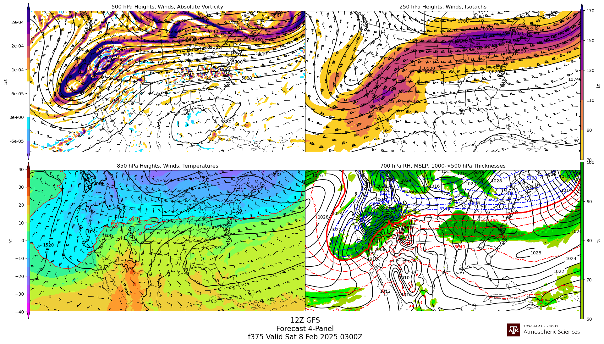
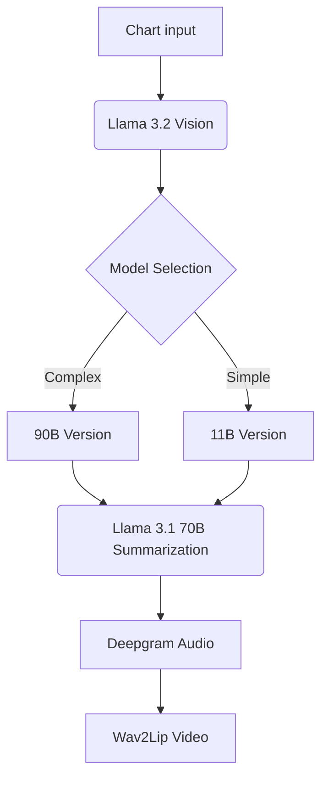

# 🌩️ NimbusNews: AI-Powered Weather Report Automation
 

*Architecture Overview: From Weather Charts to AI-Generated Video Reports*

## 📖 Overview
NimbusNews automates weather reporting by converting meteorological charts into engaging video summaries. Designed for researchers, meteorologists, and weather stations, it combines:
- **Llama 3.2 Vision models** (90B/11B) for chart analysis
- **Llama 3.1 70B** for report summarization
- **Deepgram AI** for text-to-speech conversion
- **Wav2Lip** for realistic lip-syncing
- **AWS/Cloudflare** infrastructure for scalable processing

*This is our submission for TamuHack 2025*

---

## 🛠️ Features
| Component | Technology Stack |
|-----------|-------------------|
| **Input** | User uploads or S3-stored weather charts |
| **Vision** | AWS Bedrock/Cloudflare WorkersAI (Llama 3.2 Vision) |
| **NLP** | Llama 3.1 70B for report generation |
| **Audio** | Deepgram AI voice synthesis |
| **Video** | Wav2Lip neural network for lip-syncing |
| **Storage** | AWS S3 for input/output management |

---

## 🌪️ Sample Input
  
*GFS Forecast 4-Panel Chart (500 hPa heights, 250 hPa winds, 700 hPa thicknesses)*

---

## ⚙️ Setup Instructions

### 1. Prerequisites
```bash
pip install -r requirements.txt
```
### 2. Configuration
Create a .txt file called KEYS.txt that contains the below keys in order, every line.
```env
DEEPGRAM_API_KEY
AWS_ACCESS_KEY_ID
AWS_SECRET_ACCESS_KEY
```
### 3. Launch Application
```bash
streamlit run app.py
```

## AI Workflow Pipeline

## 📜 License
MIT License

## Developers
- Dheeraj Mudireddy [Github](https://github.com/reddheeraj) [LinkedIn](https://www.linkedin.com/in/dheeraj2002reddy/)
- Praneet Surabhi [LinkedIn](https://www.linkedin.com/in/praneet-surabhi/)
- Akash Pillai [LinkedIn](https://www.linkedin.com/in/akash-pillai-n/)
